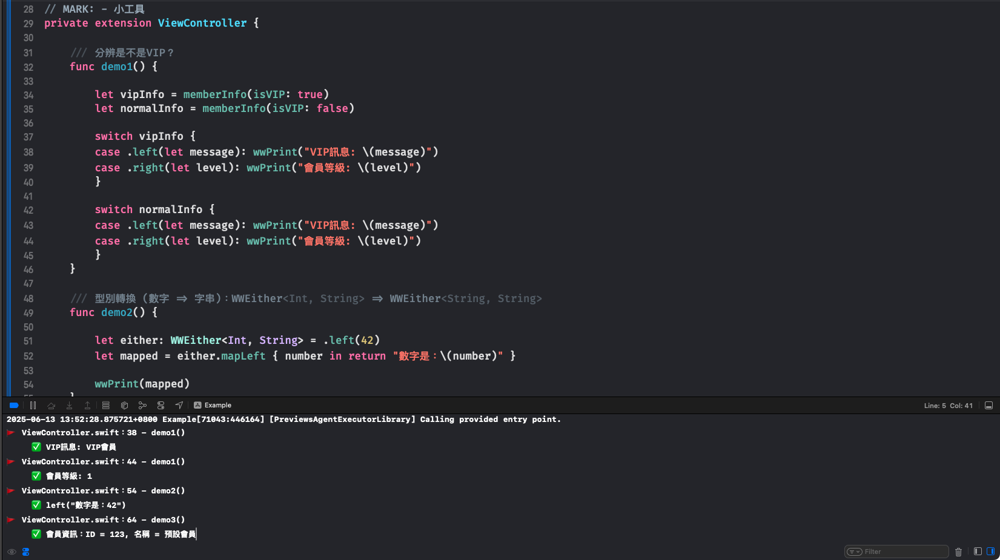

# WWEither

[](https://developer.apple.com/swift/) [](https://developer.apple.com/swift/)  [](https://developer.apple.com/swift/) [](https://developer.apple.com/swift/)

## [Introduction - 簡介](https://swiftpackageindex.com/William-Weng)
- [Imitating Rust's Either function, the Swift language can also have the function of choosing between two options.
](https://docs.rs/either/latest/either/enum.Either.html)
- [模仿Rust的Either功能，讓Swift語言也能有二選一的功能。](https://blog.csdn.net/qq_44898077/article/details/134893115)



### [Installation with Swift Package Manager](https://medium.com/彼得潘的-swift-ios-app-開發問題解答集/使用-spm-安裝第三方套件-xcode-11-新功能-2c4ffcf85b4b)
```
dependencies: [
    .package(url: "https://github.com/William-Weng/WWEither.git", .upToNextMajor(from: "1.0.0"))
]
```

## [Example](https://ezgif.com/video-to-webp)
```swift
import UIKit
import WWPrint
import WWEither

final class ViewController: UIViewController {

    private struct Member {
        let id: Int
        let name: String
    }
    
    override func viewDidLoad() {
        super.viewDidLoad()
        demo1()
        demo2()
        demo3()
    }
}

private extension ViewController {
    
    func demo1() {
        
        let vipInfo = memberInfo(isVIP: true)
        let normalInfo = memberInfo(isVIP: false)

        switch vipInfo {
        case .left(let message): wwPrint("VIP訊息: \(message)")
        case .right(let level): wwPrint("會員等級: \(level)")
        }

        switch normalInfo {
        case .left(let message): wwPrint("VIP訊息: \(message)")
        case .right(let level): wwPrint("會員等級: \(level)")
        }
    }
    
    func demo2() {
        
        let either: WWEither<Int, String> = .left(42)
        let mapped = either.mapLeft { number in return "數字是：\(number)" }
        
        wwPrint(mapped)
    }
    
    func demo3() {
        
        let memberInfo: WWEither<Int, String> = .left(123)
        let fullMemberInfo = memberInfo.mapLeft { Member(id: $0, name: "預設會員") }

        switch fullMemberInfo {
        case .left(let member): wwPrint("會員資訊：ID = \(member.id), 名稱 = \(member.name)")
        case .right(let message): wwPrint("訊息：\(message)")
        }
    }
}

private extension ViewController {

    func memberInfo(isVIP: Bool) -> WWEither<String, Int> {
        if isVIP { return .left("VIP會員") }
        return .right(1)
    }
}
```
